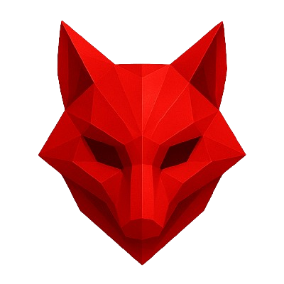

<h1 align="center"> ProjectAPI_SecondSemester </h1>

    

# 

<ul align="left">
  <h2>🧾 Índice</h2>
  <li><a href ="#visao_geral"> Visao Geral</a></li>  
  <li><a href ="#backlog"> Backlog do Produto</a></li>
  <li><a href ="#dor">DoR</a></li>
  <li><a href ="#dod">DoD</a></li>
  <li><a href ="#sprint"> Cronograma de Sprints</a></li>
  <li><a href ="#midia">Mídia</a></li>
  <li><a href ="#tecnologias">Tecnologias</a></li>
  <li><a href ="#manual">Manual de Instalação</a></li>
  <li><a href ="#equipe"> Equipe</a></li>
</ul>

---

## 👀 Visão Geral 

O objetivo principal do projeto é o desenvolvimento de uma plataforma web estruturada para centralizar, organizar e correlacionar requisitos normativos aeronáuticos. O sistema visa garantir maior organização, rastreabilidade e eficiência no processo de conformidade regulatória, servindo como uma fonte estruturada de dados para apoiar a análise de profissionais habilitados.

---

## 📋 Backlog do Produto 

| Rank | Prioridade | User Story  | Estimativa | Sprint | Status |
| :--: | :--------: | -------------------------------------------------------------------------------------------------------------------------------------------------------------------------------------------------------------- | :----------: | :----: | :------------------: |
|  1   |   Alta   | Como supervisor, quero cadastrar as normas, para que elas fiquem centralizadas e organizadas.               |     6      |   1    |    ✅   |     
|  2   |    Alta    | Como consultor, quero visualizar normas cadastradas na plataforma, para analisar os requisitos normativos.                                          |    5     |   1   |     ✅  |     
|  3   |   Alta  |         Como administrador, quero ter níveis de acesso, para garantir a segurança e integridade dos arquivos.                                                                                      |     6      |   1   |    ✅   |     
|  4   |    Alta    | Como consultor, quero filtrar normas por órgão, categoria ou palavra-chave, para localizar informações rapidamente.                                          |    5     |   2    |    ⏳  |     
|  5   |   Alta   | Como administrador, eu quero gerenciar usuários, para que apenas pessoas autorizadas tenham acesso ao sistema.                                                                                            |     5      |   2   |    ⏳  |     
|  6   |    Alta  | Como supervisor, quero editar ou atualizar normas cadastradas, para que o sistema reflita as versões mais recentes das normas.                                         |    8      |   2    |    ⏳  |    
|  7   |    Média    | Como Supervisor, eu quero adicionar o arquivo da norma, para que o sistema sempre mantenha o documento original referenciado e rastreável.                                        |    6    |   3    |    ⏳  | 
|  8   |    Média    | Como administrador, quero restringir a captura e cópia do conteúdo das normas, para proteger documentos que possuem direitos de uso pagos.                                          |    9     |   3    |    ⏳  |  

---
## ⏰ Status das Sprints do Projeto

## 1️⃣ Sprint 

  
<b>Clique aqui</b>

| Rank | Prioridade | User Story  | Estimativa | Sprint | Status |
| :--: | :--------: | -------------------------------------------------------------------------------------------------------------------------------------------------------------------------------------------------------------- | :----------: | :----: | :------------------: |
|  1   |   Alta   | Como supervisor, quero cadastrar as normas, para que elas fiquem centralizadas e organizadas.               |     6      |   1    |    ✅   |     
|  2   |    Alta    | Como consultor, quero visualizar normas cadastradas na plataforma, para analisar os requisitos normativos.                                          |    5     |   1   |     ✅  |     
|  3   |   Alta  |         Como administrador, quero ter níveis de acesso, para garantir a segurança e integridade dos arquivos.                                                                                      |     6      |   1   |    ✅   |     

## 2️⃣ Sprint 

  
<b>Clique aqui</b>

| Rank | Prioridade | User Story  | Estimativa | Sprint | Status |
| :--: | :--------: | -------------------------------------------------------------------------------------------------------------------------------------------------------------------------------------------------------------- | :----------: | :----: | :------------------: |
|  4   |    Alta    | Como consultor, quero filtrar normas por órgão, categoria ou palavra-chave, para localizar informações rapidamente.                                          |    5     |   2    |    ⏳  |     
|  5   |   Alta   | Como administrador, eu quero gerenciar usuários, para que apenas pessoas autorizadas tenham acesso ao sistema.                                                                                            |     5      |   2   |    ⏳  |     
|  6   |    Alta  | Como supervisor, quero editar ou atualizar normas cadastradas, para que o sistema reflita as versões mais recentes das normas                                         |    8      |   2    |    ⏳  |    

## 3️⃣ Sprint 

  
<b>Clique aqui</b>

| Rank | Prioridade | User Story  | Estimativa | Sprint | Status |
| :--: | :--------: | -------------------------------------------------------------------------------------------------------------------------------------------------------------------------------------------------------------- | :----------: | :----: | :------------------: |
|  7   |    Média    | Como Supervisor, eu quero adicionar o arquivo da norma, para que o sistema sempre mantenha o documento original referenciado e rastreável.                                        |    6    |   3    |    ⏳  | 
|  8   |    Média    | Como administrador, quero restringir a captura e cópia do conteúdo das normas, para proteger documentos que possuem direitos de uso pagos.                                          |    9     |   3    |    ⏳  |  

---

## 🏃‍ DoR - Definition of Ready 

| Título                            | Definição                                                                                     |
| ------------------------------------ | --------------------------------------------------------------------------------------------- |
| Refinamento de User Stories | Revisar se as histórias de usuário possuem critérios de aceitação claros |
| Interface e UX |   Validar se os wireframes dos panéis, filtros por órgão/categoria e o fluxo de uso estão disponíveis para implementação  |
| Alhinhamento de Dados |   Confirmar se o formato de entrada das normas aeronáuticas está validado para integração com o Backend    |
| Gestão de Seguraça |  Revisar se as definições de níveis de acesso e restrições da captura de conteúdo estão mapeadas tecnicamente   |
| Estimativa técnica |    Garantir que a tarefa foi pontuada pela equipe utilizando a escala de 1 a 10 e atribuída à sprint correta    |
| Dependências e Infraestrutura |  Identificar se há dependências externas que impeçam o início do desenvolvimento da task   |

---

## 🏆 Definition of Done 

| Título                            | Definição                                                                                     |
| ------------------------------------ | --------------------------------------------------------------------------------------------- |
| Versionamento          | O código está versionado, revisado e sem falhas críticas.        |
| Critérios de aceitação | Todos os critérios de aceitação foram validados. |
| Responsividade  |       A aplicação é responsiva e acessível em desktop e mobile.           |
| Testes  |      Testes manuais confirmam o funcionamento do sistema como planejado.          |
| Bug  |      Nenhum bug de prioridade alta permanece aberto.           |

---

## 📅 Cronograma de Sprints 

| Sprint          |    Período    | Documentação                                     | Status |
| --------------- | :-----------: | ------------------------------------------------ | ----- |
|  **SPRINT 1** | 16/03 - 05/04 | [Sprint1](docs/sprints/sprint1.md) | Concluído ✅ |
|  **SPRINT 2** | 13/04 - 03/05 | [Sprint2](docs/sprints/sprint2.md) | Não iniciado ❌ |
|  **SPRINT 3** | 11/05 - 31/05 | [Sprint3](docs/sprints/sprint3.md) | Não iniciado ❌ |

---

## 🎥 Mídia 

## Protótipo do Figma

  <a href="https://youtu.be/fxB6eTjgZxs?si=zNMAKQDaGHRZZ2NU">Clique aqui para ver o nosso protótipo do figma!</a>

## Site Sprint 1

  <a href="https://youtu.be/ZfeW5FDXJu8?si=QwjEGQNgyN8eepiY">Clique aqui e veja a primeira versão do nosso site!</a>

---

## 💻 Tecnologias 

<table align="center">
  <tr>
    <th>Linguagens</th>
    <th>Ferramentas</th>
    <th>SGBD</th>
    <th>Bibliotecas & Ambientes</th>
  </tr>
  <tr valign="top">
    <td align="center">
       
       
       
      
    </td>
    <td align="center">
       
       
      
    </td>
    <td align="center">
      
    </td>
    <td align="center">
      
       
       
    </td>
  </tr>
</table>

---

## 📖 Manual de Instalação 

### 🛠 Pré-requisitos

---

# 🧭 Guia Rápido de Contribuição

Este é um resumo das principais regras para contribuir com o projeto.  
Siga estas diretrizes para garantir **organização, rastreabilidade e qualidade no código**.

---

## 🌳 Branches

Adotamos um fluxo baseado em **GitFlow**:

| Tipo | Uso |
|------|-----|
| `main` | Código estável |
| `development` | Código em desenvolvimento |

---

## 🧩 Commits

Adotamos um padrão para manter o histórico legível e rastreável.

**Formato:** `tipo/mensagem`

| Tipo       | Descrição                                |
| :--------- | :--------------------------------------- |
| `feat`     | Nova funcionalidade                      |
| `fix`      | Correção de bug                          |
| `refactor` | Refatoração de código                    |
| `chore`    | Tarefas de build, config, etc.           |
| `docs`     | Mudanças na documentação                 |
| `style`    | Apenas formatação (ponto e vírgula, etc.) |
| `test`     | Adição ou ajuste de testes               |

---

## 🎓 Nossa Equipe 

  <table>
    <tr>
      <th>Imagem</th>
      <th>Membro</th>
      <th>Função</th>
      <th>Github</th>
      <th>Linkedin</th>
    </tr>
      <tr>
      <td></td>
      <td>Isabelly Pacheco Marinho</td>
      <td>Product Owner</td>
      <td></td>
      <td></td>
    </tr>
    <tr>
      <td></td>
      <td>Rodolfo Ferreira Venâncio</td>
      <td>Scrum Master</td>
      <td></td>
      <td></td>
    </tr>
    <tr>
      <td></td>
      <td>Vinícius Silva Lopes</td>
      <td>Desenvolvedor</td>
      <td></td>
      <td></td>
    </tr>
    <tr>
      <td></td>
      <td>Rafael Oliveira</td>
      <td>Desenvolvedor</td>
      <td></td>
      <td></td>
    </tr>
    <tr>
      <td></td>
      <td>Igor Martins</td>
      <td>Desenvolvedor</td>
      <td></td>
      <td></td>
    </tr>
      <tr>
      <td></td>
      <td>Vinícius Konishi Gregório</td>
      <td>Desenvolvedor</td>
      <td></td>
      <td></td>
    </tr>
  </table>

